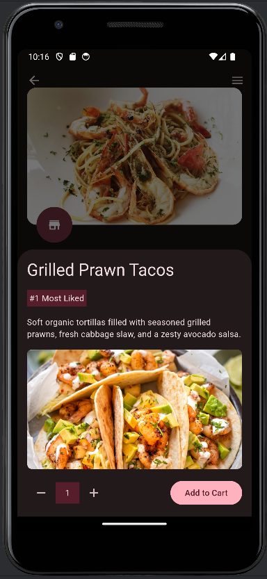
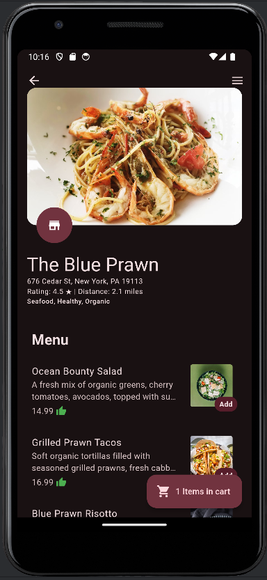
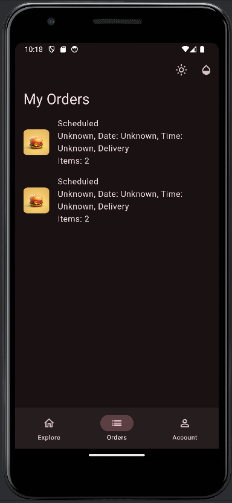

# 🍽️ Food Fusion

## 📱 About Food Fusion

Food Fusion is a vibrant social media platform tailored for food enthusiasts, crafted with Flutter. Our app is a paradise for foodies, where you can share reviews, discover new recipes, and keep an updated catalog of top culinary delights. Whether you’re a gourmet chef or a casual foodie, Food Fusion connects you with a community of like-minded individuals who share a passion for food.

## 🌟 Features

- **Reviews and Ratings:** Share your dining experiences with the community and rate your favorite dishes.
- **Recipe Discovery:** Explore an extensive collection of recipes across various cuisines, contributed by users from around the world.
- **Top Items Catalog:** Keep track of the best-rated items and find your next favorite dish.
- **Community Interaction:** Follow other foodies, comment on their posts, and exchange cooking tips.

## 🎨 App Screenshots

 <!-- Replace with your image link -->
 <!-- Replace with your image link -->
 <!-- Replace with your image link -->
 <!-- Replace with your image link -->

## 🚀 Getting Started

Follow these steps to get started with Food Fusion:

### Prerequisites

- Flutter SDK
- Android Studio or Xcode (for running on emulators)
- A GitHub account

### Installation

1. **Clone the Repository**
   ```bash
   git clone https://github.com/yourusername/food-fusion.git
   ```

2. **Navigate to the Project Directory**
   ```bash
   cd food-fusion
   ```

3. **Install Dependencies**
   ```bash
   flutter pub get
   ```

4. **Run the App**
   ```bash
   flutter run
   ```

## 🛠️ Built With

- **Flutter:** UI toolkit for building natively compiled applications.
- **Dart:** Programming language optimized for building mobile applications.

## 🤝 Contributing

We welcome contributions from the community! Here’s how you can contribute:

1. **Fork the Repository**
2. **Create a New Branch**
   ```bash
   git checkout -b feature/your-feature-name
   ```
3. **Commit Your Changes**
   ```bash
   git commit -m "Add your message here"
   ```
4. **Push to the Branch**
   ```bash
   git push origin feature/your-feature-name
   ```
5. **Create a Pull Request**

## 📜 License

This project is licensed under the [MIT License](LICENSE).
